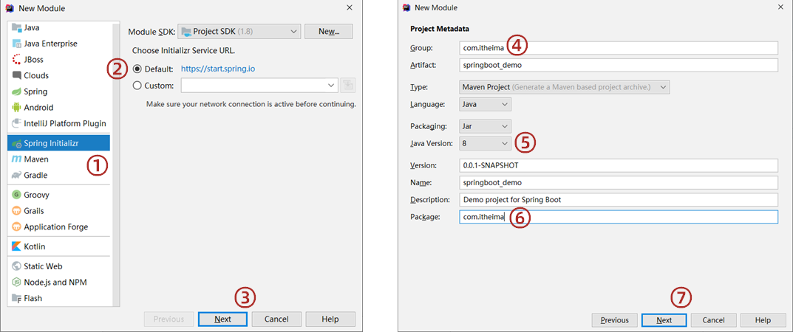
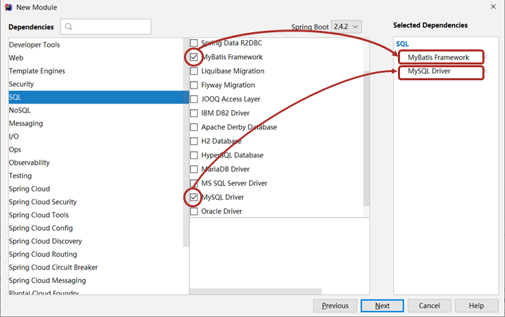

# 第三章 SpringBoot整合部分技术

SpringBoot对于其他技术有很强的整合能力，本章将整合如下几种技术：

- JUnit
- MyBatis
- MyBatis-Plus
- Druid

## 3.1 整合JUnit

SpringBoot技术的定位是用于简化开发，简化的程度相当大，下面将进行对比

### 3.1.1 Spring整合Junit

不使用SpringBoot技术时，Spring整合JUnit的操作方式：

```JAVA
//加载spring整合junit专用的类运行器
@RunWith(SpringJUnit4ClassRunner.class)
//指定对应的配置信息
@ContextConfiguration(classes = SpringConfig.class)
public class AccountServiceTestCase {
    //注入需要测试的对象
    @Autowired
    private AccountService accountService;
    @Test
    public void testGetById(){
        //执行要测试的对象对应的方法
        System.out.println(accountService.findById(2));
    }
}
```

其中核心代码是两个注解，第一个注解@RunWith是设置Spring专用于测试的类运行器，第二个注解@ContextConfiguration是用来设置Spring核心配置文件或配置类的

### 3.1.2 SpringBoot整合Junit

@RunWith和@ContextConfiguration这两个注解的信息较为固定，SpringBoot便针对这点进行简化，能使用默认值的使用默认值，具体如下：

```JAVA
@SpringBootTest
class Springboot04JunitApplicationTests {
    //注入需要测试的对象
    @Autowired
    private BookDao bookDao;
    @Test
    void contextLoads() {
        //执行要测试的对象对应的方法
        bookDao.save();
        System.out.println("two...");
    }
}
```

如果想自定义引导类有两种方式，第一种方式使用属性的形式进行，在注解@SpringBootTest中添加classes属性指定配置类

```JAVA
@SpringBootTest(classes = Springboot04JunitApplication.class)
class Springboot04JunitApplicationTests {
    //注入需要测试的对象
    @Autowired
    private BookDao bookDao;
    @Test
    void contextLoads() {
        //执行要测试的对象对应的方法
        bookDao.save();
        System.out.println("two...");
    }
}
```

第二种方式回是仍然使用@ContextConfiguration注解

```JAVA
@SpringBootTest
@ContextConfiguration(classes = Springboot04JunitApplication.class)
class Springboot04JunitApplicationTests {
    //注入需要测试的对象
    @Autowired
    private BookDao bookDao;
    @Test
    void contextLoads() {
        //执行要测试的对象对应的方法
        bookDao.save();
        System.out.println("two...");
    }
}
```

总结

1. 导入测试对应的starter
2. 测试类使用@SpringBootTest修饰
3. 使用自动装配的形式添加要测试的对象
4. 测试类如果存在于引导类所在包或子包中无需指定引导类
5. 测试类如果不存在于引导类所在的包或子包中需要通过classes属性指定引导类

## 3.2 整合MyBatis

### 3.2.1 Spring整合MyBatis

第一步，导入坐标：

```xml
<dependencies>
    <dependency>
        <groupId>com.alibaba</groupId>
        <artifactId>druid</artifactId>
        <version>1.1.16</version>
    </dependency>
    <dependency>
        <groupId>org.mybatis</groupId>
        <artifactId>mybatis</artifactId>
        <version>3.5.6</version>
    </dependency>
    <dependency>
        <groupId>mysql</groupId>
        <artifactId>mysql-connector-java</artifactId>
        <version>5.1.47</version>
    </dependency>
    <!--1.导入mybatis与spring整合的jar包-->
    <dependency>
        <groupId>org.mybatis</groupId>
        <artifactId>mybatis-spring</artifactId>
        <version>1.3.0</version>
    </dependency>
    <!--导入spring操作数据库必选的包-->
    <dependency>
        <groupId>org.springframework</groupId>
        <artifactId>spring-jdbc</artifactId>
        <version>5.2.10.RELEASE</version>
    </dependency>
</dependencies>
```

第二步，进行Spring核心配置

```java
@Configuration
@ComponentScan("com.toxicant123")
@PropertySource("jdbc.properties")
public class SpringConfig {
}
```

第三步，使用@Bean注解使得spring容器管理MyBatis

```java
//定义mybatis专用的配置类
@Configuration
public class MyBatisConfig {
    //    定义创建SqlSessionFactory对应的bean
    @Bean
    public SqlSessionFactoryBean sqlSessionFactory(DataSource dataSource) {
        //SqlSessionFactoryBean是由mybatis-spring包提供的，专用于整合用的对象
        SqlSessionFactoryBean sfb = new SqlSessionFactoryBean();
        //设置数据源替代原始配置中的environments的配置
        sfb.setDataSource(dataSource);
        //设置类型别名替代原始配置中的typeAliases的配置
        sfb.setTypeAliasesPackage("com.itheima.domain");
        return sfb;
    }

    //    定义加载所有的映射配置
    @Bean
    public MapperScannerConfigurer mapperScannerConfigurer() {
        MapperScannerConfigurer msc = new MapperScannerConfigurer();
        msc.setBasePackage("com.itheima.dao");
        return msc;
    }
}
```

第四步，配置数据源

```java
@Configuration
public class JdbcConfig {
    @Value("${jdbc.driver}")
    private String driver;
    @Value("${jdbc.url}")
    private String url;
    @Value("${jdbc.username}")
    private String userName;
    @Value("${jdbc.password}")
    private String password;

    @Bean("dataSource")
    public DataSource dataSource(){
        DruidDataSource ds = new DruidDataSource();
        ds.setDriverClassName(driver);
        ds.setUrl(url);
        ds.setUsername(userName);
        ds.setPassword(password);
        return ds;
    }
}
```

第五步，在配置文件中配置数据库连接信息

```properties
jdbc.driver=com.mysql.jdbc.Driver
jdbc.url=jdbc:mysql://localhost:3306/spring_db?useSSL=false
jdbc.username=root
jdbc.password=root
```

### 3.2.2 SpringBoot整合MyBatis

步骤一，创建模块时勾选MyBatis，由于要操作数据库，还要勾选对应数据库





或者手工导入对应技术的starter，和对应数据库的坐标

```XML
<dependencies>
    <!--1.导入对应的starter-->
    <dependency>
        <groupId>org.mybatis.spring.boot</groupId>
        <artifactId>mybatis-spring-boot-starter</artifactId>
        <version>2.2.0</version>
    </dependency>

    <dependency>
        <groupId>mysql</groupId>
        <artifactId>mysql-connector-java</artifactId>
        <scope>runtime</scope>
    </dependency>
</dependencies>
```

步骤二：配置数据源相关信息

```yaml
#2.配置相关信息
spring:
  datasource:
    driver-class-name: com.mysql.cj.jdbc.Driver
    url: jdbc:mysql://localhost:3306/ssm_db
    username: root
    password: root
```

步骤三：在pojo包下创建实体类

```java
public class User {
    private Integer id;
    private String name;

    public User() {
    }

    public User(Integer id, String name) {
        this.id = id;
        this.name = name;
    }

    public Integer getId() {
        return id;
    }

    public void setId(Integer id) {
        this.id = id;
    }

    public String getName() {
        return name;
    }

    public void setName(String name) {
        this.name = name;
    }

    @Override
    public String toString() {
        return "user{" +
                "id=" + id +
                ", name='" + name + '\'' +
                '}';
    }
}
```

步骤四：在dao包下创建映射接口

```java
@Mapper
public interface UserDao {
    @Select("select * from user where id = #{id}")
    User getById(Integer id);

    User getUserById(Integer id);
}
```

步骤五：编写并运行测试类

```java
@SpringBootTest
class Springboot05MybatisApplicationTests {

    @Autowired
    private UserDao userDao;

    @Test
    void contextLoads() {
        User userById = userDao.getUserById(1);
        System.out.println(userById);
    }

    @Test
    public void test1(){
        User byId = userDao.getById(1);
        System.out.println(byId);
    }
}
```

总结

1. 整合操作需要勾选MyBatis技术，也就是导入MyBatis对应的starter
2. 数据库连接相关信息转换成配置
3. 数据库SQL映射需要添加@Mapper被容器识别到
4. MySQL 8.X驱动强制要求设置时区
    - 修改url，添加`serverTimezone=UTC`或`serverTimezone=Asia/Shanghai`
    - 修改MySQL数据库配置文件`mysql.ini`，在mysqld项下添加`default-time-zone=+8:00`
5. 驱动类过时，会提醒更换为`com.mysql.cj.jdbc.Driver`
