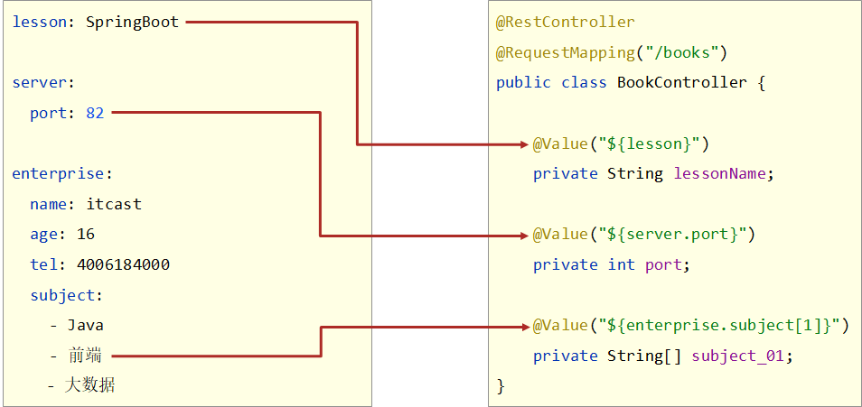
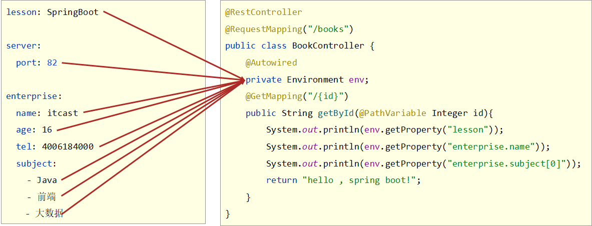
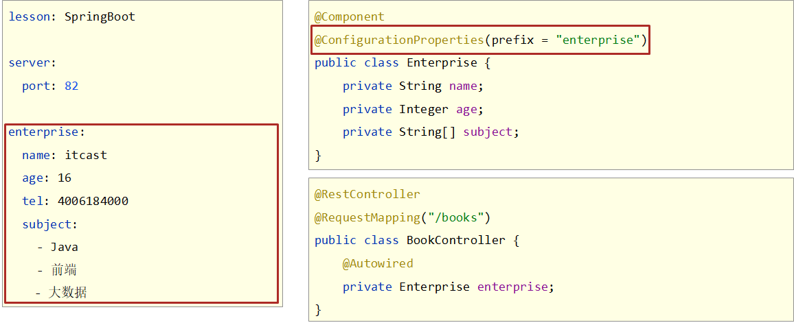
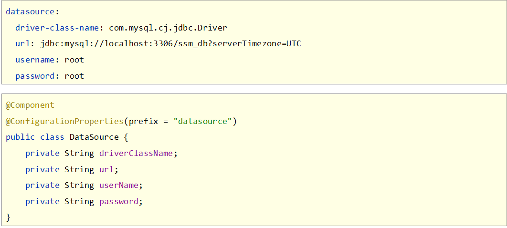

# 第二章 SpringBoot基础配置

## 2.1 属性配置

SpringBoot通过配置文件application.properties就可以修改默认的配置

properties格式的文件书写规范是key=value

```properties
name=toxicant123
```

当输入port时，会出现自动提示


根据提示敲回车，输入80端口

```properties
server.port=80
```

为了简化开发者的配置书写，便于集中管理，SpringBoot将所有配置都集中到了这一个配置文件中

其他的配置：

关闭运行日志图表（banner)：

```properties
spring.main.banner-mode=off
```

设置运行日志的显示级别

```properties
logging.level.root=debug
```

SpringBoot可配置属性汇总：https://docs.spring.io/spring-boot/docs/current/reference/html/application-properties.html#application-properties

注意：使用对应技术才能进行对应的配置

下面这个坐标定义了SpringBoot相关的基础配置

```xml
<dependency>
    <groupId>org.springframework.boot</groupId>
    <artifactId>spring-boot-starter</artifactId>
    <version>2.5.4</version>
    <scope>compile</scope>
</dependency>
```

总结：

1. SpringBoot默认配置文件是application.properties
2. application.properties文件中只要输入要配置的属性关键字就可以根据提示进行设置
3. SpringBoot将配置信息集中在一个文件中
4. SpringBoot中导入对应starter后，才提供对应配置属性
5. 书写SpringBoot配置时IDEA采用关键字+提示形式书写
6. 配置文件间的加载优先级	properties（最高）>  yml  >  yaml（最低）
7. 不同配置文件中相同配置按照加载优先级相互覆盖，不同配置文件中不同配置全部保留


## 2.2 配置文件的种类

SpringBoot支持三种格式的配置文件，分别如下:

- properties格式
- yml格式
- yaml格式

properties格式举例：

```properties
server.port=80
```

yml格式举例

```yaml
server:
  port: 81
```

yaml格式举例：

```yaml
server:
  port: 82
```

yml和yaml文件格式其实是一模一样的，只是后缀名不同。

总结

1. SpringBoot提供了3种配置文件的格式
    - properties（传统格式/默认格式）
    - yml（主流格式）
    - yaml

### 2.2.1 配置文件优先级

三种配置文件的加载优先顺序

```text
application.properties  >  application.yml  >  application.yaml
```

注意：每个配置文件中的项都会生效，但多个配置文件中相同类型的配置会被优先级高的文件覆盖。如果配置项不同的话，那所有的配置项都会生效。

## 2.3 yaml文件的语法格式

YAML（YAML Ain't Markup Language），是一种数据序列化格式。具有容易阅读、容易与脚本语言交互、以数据为核心，重数据轻格式的特点。常见的文件扩展名有两种：

- .yml格式（主流）
- .yaml格式

对于文件自身在书写时，具有严格的语法格式要求：

1. 大小写敏感
2. 属性层级关系使用多行描述，每行结尾使用冒号结束
3. 使用缩进表示层级关系，同层级左侧对齐，只允许使用空格（不允许使用Tab键）
4. 属性值前面添加空格（属性名与属性值之间使用冒号+空格作为分隔）
5. #号表示注释

常见的数据书写格式：

```YAML
boolean: TRUE  						#TRUE,true,True,FALSE,false，False均可
float: 3.14    						#6.8523015e+5  #支持科学计数法
int: 123       						#0b1010_0111_0100_1010_1110    #支持二进制、八进制、十六进制
null: ~        						#使用~表示null
string: HelloWorld      			#字符串可以直接书写
string2: "Hello World"  			#可以使用双引号包裹特殊字符
date: 2018-02-17        			#日期必须使用yyyy-MM-dd格式
datetime: 2018-02-17T15:02:31+08:00  #时间和日期之间使用T连接，最后使用+代表时区
```

yaml格式中也可以表示数组，在属性名书写位置的下方使用减号作为数据开始符号，每行书写一个数据，减号与数据间空格分隔：

```YAML
subject:
	- Java
	- 前端
	- 大数据
enterprise:
	name: itcast
    age: 16
    subject:
    	- Java
        - 前端
        - 大数据
likes: [cheese,ball]			#数组书写缩略格式
users:							 #对象数组格式一
  - name: Tom
   	age: 4
  - name: Jerry
    age: 5		    
users2:							 #对象数组格式二
  -  
    name: Tom
   	age: 4
 -   
    name: Jerry
    age: 5		    
users3: [ { name:Tom , age:4 } , { name:Jerry , age:5 } ]	#对象数组缩略格式
```

总结

1. yaml语法规则
   - 大小写敏感
   - 属性层级关系使用多行描述，每行结尾使用冒号结束
   - 使用缩进表示层级关系，同层级左侧对齐，只允许使用空格（不允许使用Tab键）
   - 属性值前面添加空格（属性名与属性值之间使用冒号+空格作为分隔）
   - #号表示注释
2. 注意属性名冒号后面与数据之间有一个空格
3. 注意字面值、对象数据格式、数组数据格式

## 2.4 yaml文件的数据读取

对于yaml文件中的数据，有三种读取方式

### 2.4.1 读取单一数据

yaml中保存的单个数据，可以使用Spring中的注解直接读取，使用@Value可以读取单个数据，属性名引用方式：${一级属性名.二级属性名……}



在使用@Value注解时，要将该注入写在某一个Spring管控的bean的属性名的上方。就可以读取到对应的单一数据行了

总结

1. 使用@Value配合SpEL读取单个数据
2. 如果数据存在多层级，依次书写层级名称即可

### 2.4.2 读取对象数据

SpringBoot提供了一个对象，叫Environment，使用自动装配注解可以将所有的yaml数据封装到这个对象中



数据封装到了Environment对象中，获取属性时，通过Environment的接口操作进行，具体方法时`getProperties(String)`，参数填写属性名即可

总结

1. 使用Environment对象封装全部配置信息
2. 使用@Autowired自动装配数据到Environment对象中

### 2.4.3 读取对象数据

SpringBoot提供了可以将一组yaml对象数据封装一个Java对象的操作

首先定义一个对象，并将该对象纳入Spring管控的范围，即定义成一个bean，然后使用注解@ConfigurationProperties指定该对象加载哪一组yaml中配置的信息。



注意：对于注解@ConfigurationProperties必须设置加载数据的前缀，且数据属性名要与对象的变量名一一对应。

例如：



总结

1. 使用@ConfigurationProperties注解绑定配置信息到封装类中
2. 封装类需要定义为Spring管理的bean，否则无法进行属性注入
