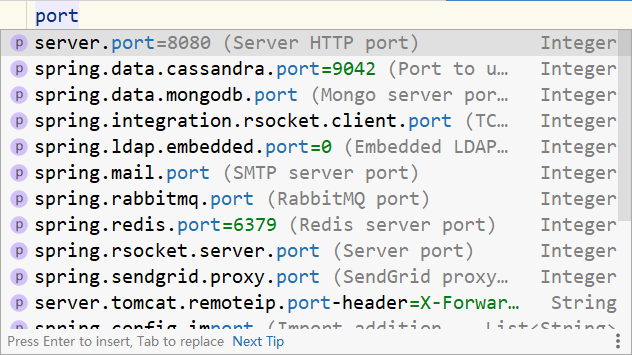

# 第二章 SpringBoot基础配置

## 2.1 属性配置

SpringBoot通过配置文件application.properties就可以修改默认的配置

properties格式的文件书写规范是key=value

```properties
name=toxicant123
```

当输入port时，会出现自动提示



根据提示敲回车，输入80端口

```properties
server.port=80
```

为了简化开发者的配置书写，便于集中管理，SpringBoot将所有配置都集中到了这一个配置文件中

其他的配置：

关闭运行日志图表（banner)：

```properties
spring.main.banner-mode=off
```

设置运行日志的显示级别

```properties
logging.level.root=debug
```

SpringBoot可配置属性汇总：https://docs.spring.io/spring-boot/docs/current/reference/html/application-properties.html#application-properties

注意：使用对应技术才能进行对应的配置

下面这个坐标定义了SpringBoot相关的基础配置

```xml
<dependency>
    <groupId>org.springframework.boot</groupId>
    <artifactId>spring-boot-starter</artifactId>
    <version>2.5.4</version>
    <scope>compile</scope>
</dependency>
```

总结：

1. SpringBoot默认配置文件是application.properties
2. application.properties文件中只要输入要配置的属性关键字就可以根据提示进行设置
3. SpringBoot将配置信息集中在一个文件中
4. SpringBoot中导入对应starter后，才提供对应配置属性
5. 书写SpringBoot配置时IDEA采用关键字+提示形式书写

