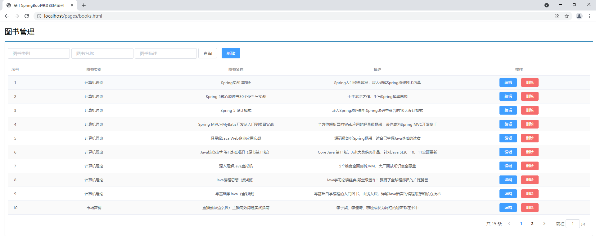
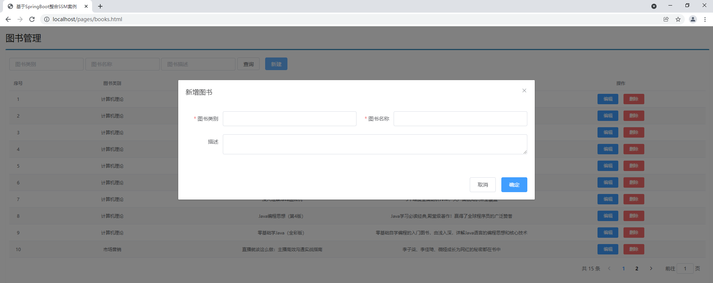
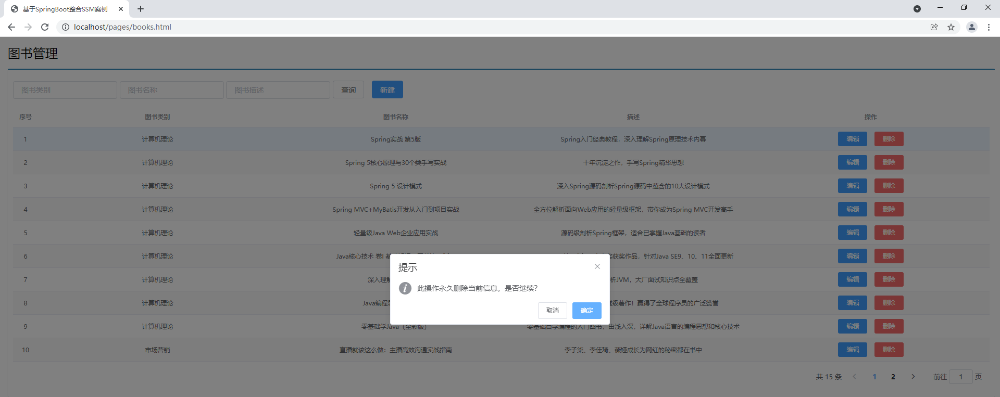
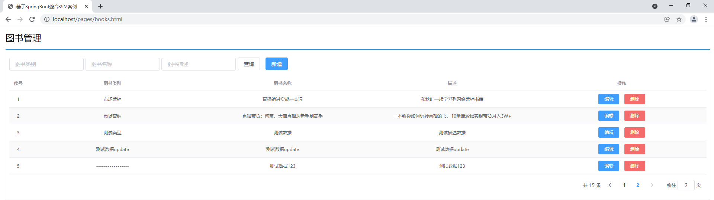
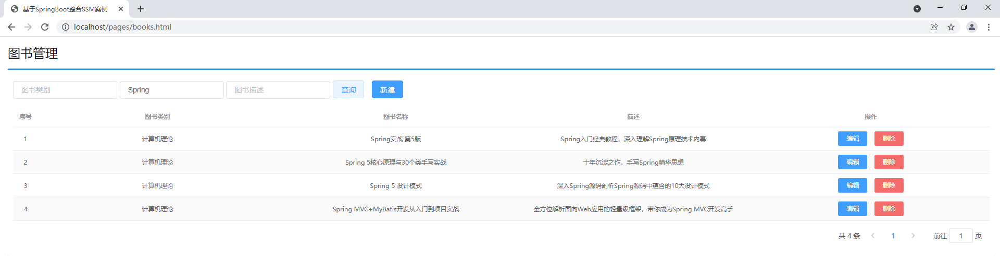
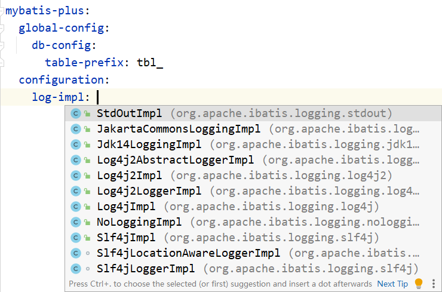

# 第四章 SSMP整合综合案例

## 4.1 最终效果

### 主页面



### 添加



### 删除




### 修改
```java
// TODO: 2022/7/17 20:35 修改的图片 
```

### 分页



### 条件查询



## 4.2 技术选型

1. 实体类开发：使用Lombok快速制作实体类
2. Dao开发：整合MyBatisPlus，制作数据层测试
3. Service开发：基于MyBatisPlus进行增量开发，制作业务层测试类
4. Controller开发：基于Restful开发，使用PostMan测试接口功能
5. Controller开发：前后端开发协议制作
6. 页面开发：基于VUE+ElementUI制作，前后端联调，页面数据处理，页面消息处理
    - 列表
    - 新增
    - 修改
    - 删除
    - 分页
    - 查询
7. 项目异常处理
8. 按条件查询：页面功能调整、Controller修正功能、Service修正功能

## 4.3 模块创建

创建一个新的SpringBoot模块，并选择web-starter，并在application.yml中配置端口为80

pom.xml：

```XML
<dependencies>
    <dependency>
        <groupId>org.springframework.boot</groupId>
        <artifactId>spring-boot-starter-web</artifactId>
    </dependency>
    <dependency>
        <groupId>org.springframework.boot</groupId>
        <artifactId>spring-boot-starter-test</artifactId>
        <scope>test</scope>
    </dependency>
</dependencies>
```

**application.yml**

```yaml
server:
  port: 80
```

## 4.4 实体类开发

数据库表及数据用如下SQL：

```sql
-- ----------------------------
-- Table structure for tbl_book
-- ----------------------------
DROP TABLE IF EXISTS `tbl_book`;
CREATE TABLE `tbl_book`  (
  `id` int(11) NOT NULL AUTO_INCREMENT,
  `type` varchar(20) CHARACTER SET utf8 COLLATE utf8_general_ci NULL DEFAULT NULL,
  `name` varchar(50) CHARACTER SET utf8 COLLATE utf8_general_ci NULL DEFAULT NULL,
  `description` varchar(255) CHARACTER SET utf8 COLLATE utf8_general_ci NULL DEFAULT NULL,
  PRIMARY KEY (`id`) USING BTREE
) ENGINE = InnoDB AUTO_INCREMENT = 51 CHARACTER SET = utf8 COLLATE = utf8_general_ci ROW_FORMAT = Dynamic;

-- ----------------------------
-- Records of tbl_book
-- ----------------------------
INSERT INTO `tbl_book` VALUES (1, '计算机理论', 'Spring实战 第5版', 'Spring入门经典教程，深入理解Spring原理技术内幕');
INSERT INTO `tbl_book` VALUES (2, '计算机理论', 'Spring 5核心原理与30个类手写实战', '十年沉淀之作，手写Spring精华思想');
INSERT INTO `tbl_book` VALUES (3, '计算机理论', 'Spring 5 设计模式', '深入Spring源码剖析Spring源码中蕴含的10大设计模式');
INSERT INTO `tbl_book` VALUES (4, '计算机理论', 'Spring MVC+MyBatis开发从入门到项目实战', '全方位解析面向Web应用的轻量级框架，带你成为Spring MVC开发高手');
INSERT INTO `tbl_book` VALUES (5, '计算机理论', '轻量级Java Web企业应用实战', '源码级剖析Spring框架，适合已掌握Java基础的读者');
INSERT INTO `tbl_book` VALUES (6, '计算机理论', 'Java核心技术 卷I 基础知识（原书第11版）', 'Core Java 第11版，Jolt大奖获奖作品，针对Java SE9、10、11全面更新');
INSERT INTO `tbl_book` VALUES (7, '计算机理论', '深入理解Java虚拟机', '5个维度全面剖析JVM，大厂面试知识点全覆盖');
INSERT INTO `tbl_book` VALUES (8, '计算机理论', 'Java编程思想（第4版）', 'Java学习必读经典,殿堂级著作！赢得了全球程序员的广泛赞誉');
INSERT INTO `tbl_book` VALUES (9, '计算机理论', '零基础学Java（全彩版）', '零基础自学编程的入门图书，由浅入深，详解Java语言的编程思想和核心技术');
INSERT INTO `tbl_book` VALUES (10, '市场营销', '直播就该这么做：主播高效沟通实战指南', '李子柒、李佳琦、薇娅成长为网红的秘密都在书中');
INSERT INTO `tbl_book` VALUES (11, '市场营销', '直播销讲实战一本通', '和秋叶一起学系列网络营销书籍');
INSERT INTO `tbl_book` VALUES (12, '市场营销', '直播带货：淘宝、天猫直播从新手到高手', '一本教你如何玩转直播的书，10堂课轻松实现带货月入3W+');
```

根据上述表结构，创建pojo包并写出对应的实体类

```JAVA
public class Book {
    private Integer id;
    private String type;
    private String name;
    private String description;
}
```

实体类的开发可以手动生成get/set方法，然后覆盖toString()方法，但此处用更为简便的lombok注解

Lombok，是一个Java类库，提供了一组注解，用于简化实体类开发，SpringBoot目前默认集成了lombok技术，并提供了对应的版本控制，所以只需要提供对应的坐标即可，在pom.xml中添加lombok的坐标

```XML
<dependencies>
    <!--lombok-->
    <dependency>
        <groupId>org.projectlombok</groupId>
        <artifactId>lombok</artifactId>
    </dependency>
</dependencies>
```

通过lombok的一个注解@Data完成对一个实体类添加getter，setter，toString，equals，hashCode等方法

```JAVA
import lombok.Data;
@Data
public class Book {
    private Integer id;
    private String type;
    private String name;
    private String description;
}
```

#### 总结

1. 实体类制作
2. 使用lombok简化开发
   - 导入lombok无需指定版本，由SpringBoot提供版本
   - @Data注解

## 4.5 数据层开发——基础CRUD

步骤一：导入MyBatisPlus与Druid对应的starter，还有mysql的驱动

```xml
<dependencies>
    <dependency>
        <groupId>com.baomidou</groupId>
        <artifactId>mybatis-plus-boot-starter</artifactId>
        <version>3.4.3</version>
    </dependency>
    <dependency>
        <groupId>com.alibaba</groupId>
        <artifactId>druid-spring-boot-starter</artifactId>
        <version>1.2.6</version>
    </dependency>
    <dependency>
        <groupId>mysql</groupId>
        <artifactId>mysql-connector-java</artifactId>
        <scope>runtime</scope>
    </dependency>
</dependencies>
```

步骤二：配置数据库连接相关的数据源配置

```YAML
server:
  port: 80

spring:
  datasource:
    druid:
      driver-class-name: com.mysql.cj.jdbc.Driver
      url: jdbc:mysql://localhost:3306/ssm_db?serverTimezone=UTC
      username: root
      password: root
```

步骤三：创建mapper接口，并继承MyBatis-Plus的标准通用接口BaseMapper，在加上@Mapper注解和BaseMapper的泛型

```JAVA
@Mapper
public interface BookDao extends BaseMapper<Book> {
}
```

步骤四：编写测试类

```JAVA
package com.itheima.dao;

import com.baomidou.mybatisplus.core.conditions.query.LambdaQueryWrapper;
import com.baomidou.mybatisplus.core.conditions.query.QueryWrapper;
import com.baomidou.mybatisplus.core.metadata.IPage;
import com.baomidou.mybatisplus.extension.plugins.pagination.Page;
import com.itheima.domain.Book;
import org.junit.jupiter.api.Test;
import org.springframework.beans.factory.annotation.Autowired;
import org.springframework.boot.test.context.SpringBootTest;

@SpringBootTest
public class BookDaoTestCase {

    @Autowired
    private BookDao bookDao;

    @Test
    void testGetById(){
        System.out.println(bookDao.selectById(1));
    }

    @Test
    void testSave(){
        Book book = new Book();
        book.setType("测试数据123");
        book.setName("测试数据123");
        book.setDescription("测试数据123");
        bookDao.insert(book);
    }

    @Test
    void testUpdate(){
        Book book = new Book();
        book.setId(17);
        book.setType("测试数据abcdefg");
        book.setName("测试数据123");
        book.setDescription("测试数据123");
        bookDao.updateById(book);
    }

    @Test
    void testDelete(){
        bookDao.deleteById(16);
    }

    @Test
    void testGetAll(){
        bookDao.selectList(null);
    }
}
```

MyBatis-Plus默认的主键生成策略为雪花算法，生成的主键ID长度较大，和目前的数据库设定规则不相符，需要配置一下使MyBatis-Plus使用数据库的主键生成策略，application.yml中添加对应配置即可

```yaml
server:
  port: 80

spring:
  datasource:
    druid:
      driver-class-name: com.mysql.cj.jdbc.Driver
      url: jdbc:mysql://localhost:3306/ssm_db?serverTimezone=UTC
      username: root
      password: root

mybatis-plus:
  global-config:
    db-config:
      table-prefix: tbl_		#设置表名通用前缀
      id-type: auto				#设置主键id字段的生成策略为参照数据库设定的策略，当前数据库设置id生成策略为自增
```

### 开启MyBatis-Plus运行日志

SpringBoot可以通过配置的形式查阅执行期SQL语句，配置如下

```YAML
mybatis-plus:
  global-config:
    db-config:
      table-prefix: tbl_
      id-type: auto
  configuration:
    log-impl: org.apache.ibatis.logging.stdout.StdOutImpl
```

再来看运行结果，此时就显示了运行期执行SQL的情况

```text
Creating a new SqlSession
SqlSession [org.apache.ibatis.session.defaults.DefaultSqlSession@2c9a6717] was not registered for synchronization because synchronization is not active
JDBC Connection [com.mysql.cj.jdbc.ConnectionImpl@6ca30b8a] will not be managed by Spring
==>  Preparing: SELECT id,type,name,description FROM tbl_book
==> Parameters: 
<==    Columns: id, type, name, description
<==        Row: 1, 计算机理论, Spring实战 第5版, Spring入门经典教程，深入理解Spring原理技术内幕
<==        Row: 2, 计算机理论, Spring 5核心原理与30个类手写实战, 十年沉淀之作，手写Spring精华思想
<==        Row: 3, 计算机理论, Spring 5 设计模式, 深入Spring源码剖析Spring源码中蕴含的10大设计模式
<==        Row: 4, 计算机理论, Spring MVC+MyBatis开发从入门到项目实战, 全方位解析面向Web应用的轻量级框架，带你成为Spring MVC开发高手
<==        Row: 5, 计算机理论, 轻量级Java Web企业应用实战, 源码级剖析Spring框架，适合已掌握Java基础的读者
<==        Row: 6, 计算机理论, Java核心技术 卷I 基础知识（原书第11版）, Core Java 第11版，Jolt大奖获奖作品，针对Java SE9、10、11全面更新
<==        Row: 7, 计算机理论, 深入理解Java虚拟机, 5个维度全面剖析JVM，大厂面试知识点全覆盖
<==        Row: 8, 计算机理论, Java编程思想（第4版）, Java学习必读经典,殿堂级著作！赢得了全球程序员的广泛赞誉
<==        Row: 9, 计算机理论, 零基础学Java（全彩版）, 零基础自学编程的入门图书，由浅入深，详解Java语言的编程思想和核心技术
<==        Row: 10, 市场营销, 直播就该这么做：主播高效沟通实战指南, 李子柒、李佳琦、薇娅成长为网红的秘密都在书中
<==        Row: 11, 市场营销, 直播销讲实战一本通, 和秋叶一起学系列网络营销书籍
<==        Row: 12, 市场营销, 直播带货：淘宝、天猫直播从新手到高手, 一本教你如何玩转直播的书，10堂课轻松实现带货月入3W+
<==        Row: 13, 测试类型, 测试数据, 测试描述数据
<==        Row: 14, 测试数据update, 测试数据update, 测试数据update
<==        Row: 15, -----------------, 测试数据123, 测试数据123
<==      Total: 15
```

其中清晰的标注了当前执行的SQL语句是什么，携带了什么参数，对应的执行结果是什么，信息很全面

此处设4置的是日志的显示形式，当前配置的是控制台输出，当然还可以由更多的选择，根据需求切换即可



### 总结

1. 手动导入starter坐标（2个），mysql驱动（1个）
2. 配置数据源与MyBatisPlus对应的配置
3. 开发Dao接口（继承BaseMapper）
4. 制作测试类测试Dao功能是否有效
5. 使用配置方式开启日志，设置日志输出方式为标准输出即可查阅SQL执行日志

## 4.6 数据层开发——分页功能制作

MyBatis-Plus提供的分页操作API如下

```java
public class Example {
   @Test
   void testGetPage(){
      IPage page = new Page(2,5);
      bookDao.selectPage(page, null);
      System.out.println(page.getCurrent());
      System.out.println(page.getSize());
      System.out.println(page.getTotal());
      System.out.println(page.getPages());
      System.out.println(page.getRecords());
   }
}
```

其中selectPage方法需要传入一个封装分页数据的对象，可以通过new的形式创建这个对象，创建此对象时就需要指定分页的两个基本数据：

- 当前显示第几页
- 每页显示几条数据

- 可以通过创建Page对象时利用构造方法初始化这两个数据